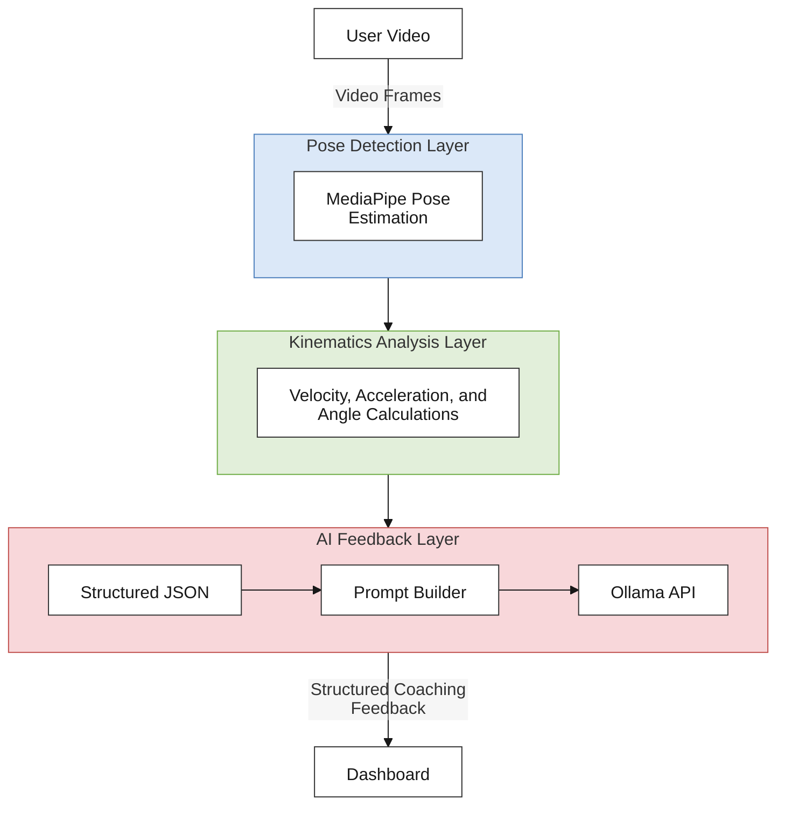

<a id="readme-top"></a>

# FormGuard: AI-Powered Badminton E-Coaching Web App

<div style="text-align: center">
  
  
  
</div>
<br>


<details>
  <summary><b>Table of Contents</b></summary>
  <ol type="A">
    <li><a style="color: white" href="#️-about-the-project">⁉️ About The Project</a></li>
    <li><a style="color: white" href="#️-features">⚙️ Features</a></li>
    <li>
      <a style="color: white" href="#️-system-architecture">🏗️ System Architecture</a>
      <ol style="disc">
        <li><a style="color: white" href="#1-pose-detection-layer">Pose Detection Layer</a></li>
        <li><a style="color: white" href="#2-kinematics-analysis-layer">Kinematics Analysis Layer</a></li>
        <li><a style="color: white" href="#3-ai-feedback-layer">AI Feedback Layer</a></li>
      </ol>
    </li>
    <li><a style="color: white" href="#️-tech-stack">🛠️ Tech Stack</a></li>
    <li><a style="color: white" href="#-project-structure">📁 Project Structure</a></li>
    <li><a style="color: white" href="#-getting-started">🚀 Getting Started</a></li>
  </ol>
</details>


## ⁉️ About The Project
Formguard is an AI-powered e-coaching platform that utilizes MediaPipe Pose Estimation for pose detection and locally hosted Ollama Large Language Model (LLM) for the coaching feedback. The system extracts skeletal landmarks from and appying kinematic calculus (peak velocity, peak acceleration, & key joint angles), then passes all of this data to an LLM that compare it against an expert reference that provides a structured coaching response.

<!-- Provide App Screenshots -->


<p align="right">[<a href="#readme-top">back to top</a>]</p>

## ⚙️ Features
- Landing Page
- User Login/Signup
- AI Coaching Feedback
- Progress tracking dashboard
- **Supported Techniques**
  - Serving
  - Clear
  - Smash


<p align="right">[<a href="#readme-top">back to top</a>]</p>

## 🏗️ System Architecture


### 1. Pose Detection Layer
This layer is responsible for extracting the pose landmarks from the video frames.

### 2. Kinematics Analysis Layer
Computes the biomechanical measurements such as joint angles, movement velocity, and acceleration throughout the execution of the selected badminton technique.

### 3. AI Feedback Layer
Converts the computations from the kinematics layer along with the pose landmarks into a structured JSON prompt. The LLM (Ollama) will then provide a coaching feedback in natural language.


<p align="right">[<a href="#readme-top">back to top</a>]</p>

## 🛠️ Tech Stack
[![Vite][Vite-shield]](http://sass-lang.com)
[![ESLint][eslint-shiled]](https://eslint.org)
[![React][React-shiled]](https://reactjs.org)
[![React Router][React_Router-shiled]](https://reactrouter.com)
[![Supabase][supabase-shiled]](https://supabase.com)
[![MediaPipe][mediapipe-shiled]](https://developers.google.com/edge/mediapipe/solutions/vision/pose_landmarker)
[![Ollama][ollama-shiled]](https://ollama.com)


<p align="right">[<a href="#readme-top">back to top</a>]</p>

## 📁 Project Structure
```js
`public`              // logo & model assests
`src/`  
├─ assets             // images and svgs
├─ components         // UI components grouped by feature
├─ context            // global context and state
├─ features           // app features
├─ hooks              // custom hooks
├─ library            // utility / helpers
├─ pages              // app pages
├─ service            // services for the backend
├─ styles             // SASS stylings
├─ LandingApp.jsx     // landing entry point
├─ DashboardApp.jsx   // dashboard entry point
├─ App.jsx            // root app component
└─ main.jsx           // entry point
```

<p align="right">[<a href="#readme-top">back to top</a>]</p>

## 🚀 Getting Started
### Prerequisites
- Node.js 22+ (recommended)
- npm or a compatible package manager
- Ollama

### 1. Initial Setup
```bash
# clone repository
git clone https://github.com/Jose-Victorino/FormGuard
cd FormGuard

# Install dependencies
npm install

# Create .env.local file
cp .env.example .env.local
```

### 2. Supabase and LLM Configuration
```bash
VITE_SUPABASE_URL=lorem
VITE_SUPABASE_KEY=lorem
VITE_SUPABASE_BUCKET=lorem

VITE_LLM_MODEL=lorem      # model of your choice
```
### 3. Start the dev server
```bash
npm run dev
```


<p align="right">[<a href="#readme-top">back to top</a>]</p>

---
This project is made for academic purposes.


[Vite-shield]: https://img.shields.io/badge/Vite-17003d?style=for-the-badge&logo=vite&logoColor=863BFF
[React-shiled]: https://img.shields.io/badge/React-20232A?style=for-the-badge&logo=react&logoColor=61DAFB
[React_Router-shiled]: https://img.shields.io/badge/React_Router-52050b?style=for-the-badge&logo=reactrouter&logoColor=fff
[eslint-shiled]: https://img.shields.io/badge/ESLint-101828?style=for-the-badge&logo=eslint&logoColor=4b32c3
[supabase-shiled]: https://img.shields.io/badge/Supabase-11181C?style=for-the-badge&logo=supabase&logoColor=3ECF8E
[ollama-shiled]: https://img.shields.io/badge/Ollama-ffffff?style=for-the-badge&logo=ollama&logoColor=000000
[mediapipe-shiled]: https://img.shields.io/badge/MediaPipe-ffffff?style=for-the-badge&logo=mediapipe&logoColor=0097a7